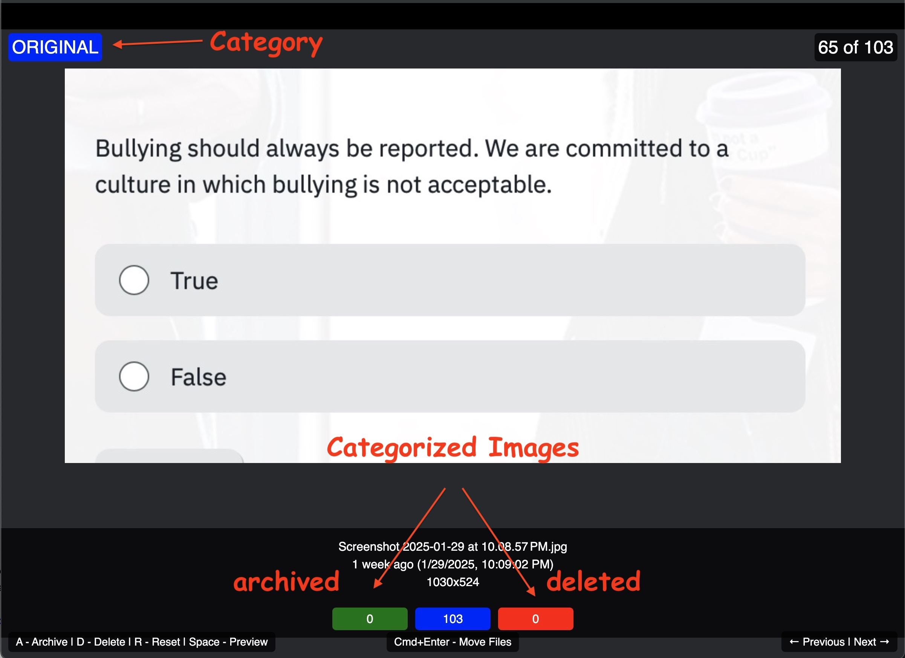

# Electron ImGoozr



Electron ImGoozr is an image organization tool designed for efficient sorting and categorization of images. It allows users to quickly navigate through a directory of images, categorize them as archive or trash, and preview images when needed.
## Installation

1. Ensure you have Node.js installed on your system. If not, download and install it from [nodejs.org](https://nodejs.org/).

2. Clone this repository:
```bash
git clone https://github.com/DrPorkins/electron-imgoozr.git
```

3. Navigate to the project directory:
```bash
cd electron-imgoozr
```

4. Install the dependencies:
```bash
npm install
```

5. Start the application:
```bash
npm start
```

## Functionality

- Select a directory of images to organize
- Navigate through images using arrow keys
- Categorize images as archive or trash
- Preview images in the default system viewer
- Move categorized images to their respective folders

**Note:**
- Images marked for deletion are moved to a locally defined trash folder, not permanently deleted. This allows for easy recovery if needed.
- Archived images are moved to a locally defined archive folder, keeping them organized but easily accessible.

## Key Shortcuts

The application is designed for two-handed operation:

Left Hand:
- `A` - Archive the current image
- `D` - Mark the current image for deletion (trash)
- `R` - Reset the current image's category

Right Hand:
- `→` (Right Arrow) - Move to the next image
- `←` (Left Arrow) - Move to the previous image
- `↓` (Down Arrow) - Skip to the next uncategorized image

Additional Controls:
- `Space` - Preview the current image in the system's default viewer
- `Cmd + Enter` (Mac) / `Ctrl + Enter` (Windows/Linux) - Move all categorized images to their respective folders

## Usage

1. Launch the application
2. Click "Select Directory with Images" to choose a folder
3. Use the keyboard shortcuts to navigate and categorize images
4. When finished, use `Cmd + Enter` (Mac) or `Ctrl + Enter` (Windows/Linux) to move the images

This two-handed design allows for rapid categorization and navigation, optimizing the workflow for efficient image organization.
